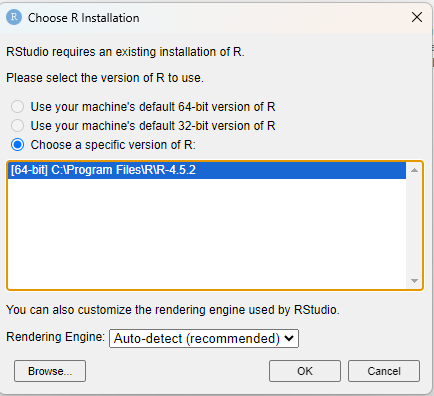
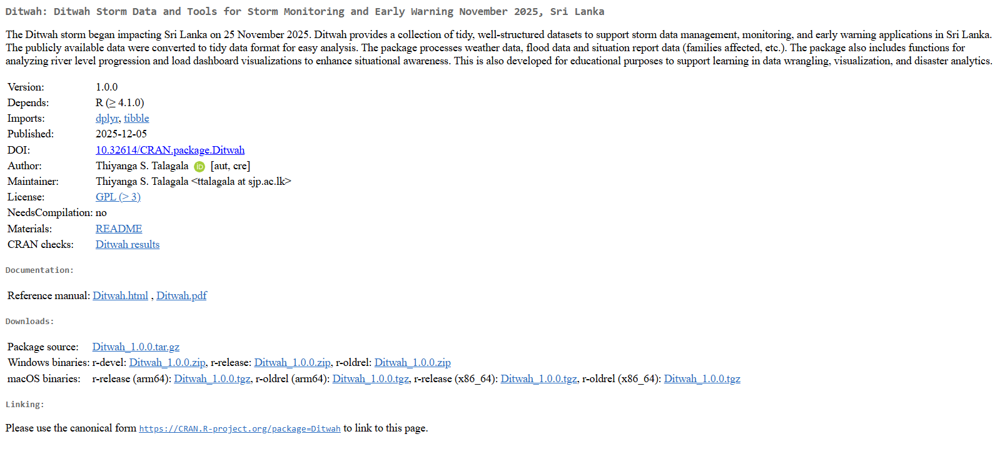

# Software We Need

1.  [R](https://posit.co/download/rstudio-desktop/)

2.  [RStudio](https://posit.co/download/rstudio-desktop/)

3.  [R tools](https://cran.r-project.org/bin/windows/Rtools/)

After installing software double click on the "RStudio" icon. If you see a message like below select "Choose a specific version in R".



# Creat R Project

File -> New Project

(In-class demonstration)

# R Packages

1.  tidyverse

2.  Ditwah

 

## Install Packages

``` r
install.packages("tidyverse")
install.packages("Ditwah")
```

## Load Packages

```{r}
library(tidyverse)
library(Ditwah)
```

# Data Wrangling with `dplyr`

## Data

```{r}
weather_report
```

```{r}
weather_report$Reporting_Time |> unique()
```

```{r}
situation_report_30NOV1600
```

# dplyr verbs for data wrangling

## filter

```{r}
weather_report |> filter(Daily_Rainfall_mm > 100)
```

```{r}
weather_report |> filter(Daily_Rainfall_mm > 300)

```

## select

```{r}
weather_report |> select(1:2)

```

```{r}
weather_report |> select(Name, Daily_Rainfall_mm)

```

## mutate

```{r}
weather_report |>
  mutate(status = ifelse(Daily_Rainfall_mm > 100, "High", "Low"))
```

```r
df <- weather_report |> select(Name, Daily_Rainfall_mm) |> filter(1:3)
df
```

Not working why

```{r}
df <- weather_report |>
  select(Name, Daily_Rainfall_mm) |>
  slice(1:3)
df
```

```{r}
df |> mutate(Province = c("North Central", "Uva", "Uva"))
```

```{r}
df2 <- df |> mutate(Province = c("North Central", "Uva", "Uva"))
df2
```

## summarise

```{r}
weather_report |>
  summarise(mean=mean(Daily_Rainfall_mm),
            sd=sd(Daily_Rainfall_mm),
            max=max(Daily_Rainfall_mm),
            min=min(Daily_Rainfall_mm),
            median=median(Daily_Rainfall_mm))
```

```{r}
weather_report |>
  summarise(mean=mean(Daily_Rainfall_mm, na.rm=TRUE),
            sd=sd(Daily_Rainfall_mm, na.rm=TRUE),
            max=max(Daily_Rainfall_mm, na.rm=TRUE),
            min=min(Daily_Rainfall_mm, na.rm=TRUE),
            median=median(Daily_Rainfall_mm, na.rm = TRUE))
```

```{r}
weather_report2 <- weather_report |>
  filter(Daily_Rainfall_mm != "TR") 
weather_report2
```


```{r}
weather_report2 |>
  summarise(mean=mean(Daily_Rainfall_mm, na.rm=TRUE),
            sd=sd(Daily_Rainfall_mm, na.rm=TRUE),
            max=max(Daily_Rainfall_mm, na.rm=TRUE),
            min=min(Daily_Rainfall_mm, na.rm=TRUE),
            median=median(Daily_Rainfall_mm, na.rm = TRUE))
```


```{r}
weather_report2 <- weather_report2 |>
  mutate(Daily_Rainfall_mm = as.numeric(Daily_Rainfall_mm))
weather_report2
```

```{r}
weather_report2 |>
  summarise(mean=mean(Daily_Rainfall_mm, na.rm=TRUE),
            sd=sd(Daily_Rainfall_mm, na.rm=TRUE),
            max=max(Daily_Rainfall_mm, na.rm=TRUE),
            min=min(Daily_Rainfall_mm, na.rm=TRUE),
            median=median(Daily_Rainfall_mm, na.rm = TRUE))
```


## arrange

```{r}
weather_report2 |> arrange(Daily_Rainfall_mm)
```

```{r}
weather_report2 |> arrange(desc(Daily_Rainfall_mm))
```


## group_by

```{r}
df <- weather_report |>
  select(Name, Daily_Rainfall_mm) |>
  slice(1:3)
df

df2 <- df |> mutate(Province = c("North Central", "Uva", "Uva"),
                    Daily_Rainfall_mm = as.numeric(Daily_Rainfall_mm)) 
df2
```

```{r}
df2 |> summarise(mean = mean(Daily_Rainfall_mm))
```

```{r}
df2 |> group_by(Province) |> summarise(mean = mean(Daily_Rainfall_mm))
```

## rename

```{r}
weather_report
weather_report |>
  rename(Rainfall = Daily_Rainfall_mm)
weather_report
```

# Reading a Data Set from xlsx file inside your current working directory

```r
library(readxl)
data <- read_excel("myfile.xlsx")
data
```